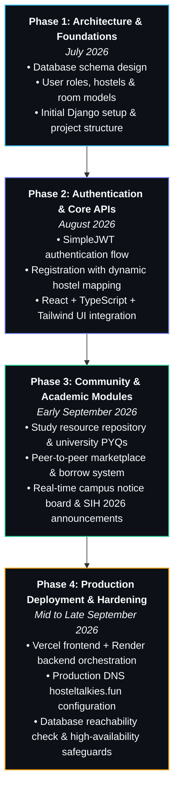

<p align="center">
  
</p>

<p align="center">
  <a href="https://github.com/siddharth194thakur-gif">
    
  </a>
</p>

<p align="center">
  <a href="https://hosteltalkies.fun"></a>
  <a href="mailto:siddharth194.thakur@gmail.com"></a>
  <a href="https://github.com/siddharth194thakur-gif"></a>
  
</p>

---

### 👨‍💻 About Me

I am a **B.Tech Computer Science & Engineering student** dedicated to backend architecture, modern web development, and practical AI applications.

- ⚙️ **Backend Engineering**: Designing secure, well-structured RESTful APIs using **Python**, **Django**, **Django REST Framework**, and **FastAPI** with **PostgreSQL**.
- 🧠 **AI & Machine Learning**: Exploring **Generative AI**, **Large Language Models (LLMs)**, **Retrieval-Augmented Generation (RAG)**, and autonomous **Agentic AI workflows**.
- 🚀 **Production-Minded**: I believe in learning by shipping authentic software to real users — managing migrations, token lifecycles, CORS security, and database resilience.

---

### 🧠 Currently Learning & Deepening

```
  ┌─────────────────────────────────────────────────────────────────────────────┐
  │  Core Foundations  : Python • DSA • DBMS • SQL • Operating Systems          │
  │  Backend Systems   : FastAPI • Django REST Framework • PostgreSQL Schemas    │
  │  Applied AI / ML   : PyTorch • RAG Architectures • LLM Prompt & Tool Use    │
  │  Agentic AI        : Multi-Agent Workflows • Tool Augmentation • Vector DBs │
  │  Cloud & DevOps    : AWS Core Services • Docker Containerization • CI/CD    │
  └─────────────────────────────────────────────────────────────────────────────┘
```

---

### 🛠️ Tech Stack & Tooling

<p align="center">

#### Languages


#### Backend Architecture & APIs


#### Databases & Storage


#### Frontend


#### AI / Machine Learning (Foundations & Learning)


#### Cloud, DevOps & Tools


</p>

---

### 🚀 Featured Project: HostelTalkies

<div align="center">
  <h3><b>🏢 HostelTalkies — Campus &amp; Hostel Community Platform</b></h3>
  <p><i>"Your Hostel. Your People. Your Talkies."</i></p>
  <p>
    <a href="https://hosteltalkies.fun"><b>🌐 Live Website: hosteltalkies.fun</b></a> •
    <a href="https://github.com/siddharth194thakur-gif/Hostel-Talkies-Backend"><b>⚙️ Backend Repository</b></a> •
    <a href="https://github.com/siddharth194thakur-gif/Hostel-Talkies-Frontend"><b>🎨 Frontend Repository</b></a>
  </p>
</div>

**HostelTalkies** is a full-stack campus and hostel management ecosystem built to solve communication fragmentation, academic sharing hurdles, and student commerce in university dormitories.

#### Key Features:
- 🏛️ **Dynamic Hostel Hierarchy**: Live cascading selection of 16 university hostels, blocks, and room numbers.
- 📦 **P2P Marketplace & Borrow Tracker**: Student listings, item giveaways, and borrow/lend tracking workflows.
- 📚 **Academic Study Library**: Course notes, semester study resources, and previous year question papers (PYQs).
- 📢 **Campus Notices & Events**: Official administration circulars and hackathon activity announcements (e.g. SIH 2026).
- 🛡️ **Defensive Architecture**: Stateless JWT with automatic refresh lifecycle, robust CORS handling, and automatic database reachability safeguards.

```
Frontend:  React 19 • TypeScript • Tailwind CSS • Vite • Axios (Deployed on Vercel)
Backend:   Django 5 • Django REST Framework • SimpleJWT • Gunicorn (Deployed on Render)
Database:  PostgreSQL (Production) • SQLite (Local / Fallback Safeguard)
```

---

### 📈 Genuine 4-Month Development Journey

A continuous, authentic evolution across several months of real Git commits:



---

### 📦 Other Notable Projects

#### 📄 [PYQ Sensie — Academic Past Papers Explorer](https://github.com/siddharth194thakur-gif)
- **Overview**: An academic study companion designed for university students to search, filter, and access past examination question papers and syllabus resources.
- **Tech Stack**: Next.js, React, TypeScript, Tailwind CSS.
- **Highlights**: Responsive PDF viewer integration, branch-wise question catalog, and fast client-side indexing.

---

### 🐍 GitHub Contribution Activity

<p align="center">
  <picture>
    <source media="(prefers-color-scheme: dark)" srcset="https://raw.githubusercontent.com/siddharth194thakur-gif/siddharth194thakur-gif/output/github-contribution-grid-snake-dark.svg">
    <source media="(prefers-color-scheme: light)" srcset="https://raw.githubusercontent.com/siddharth194thakur-gif/siddharth194thakur-gif/output/github-contribution-grid-snake.svg">
    
  </picture>
</p>

---

### 📊 GitHub Statistics

<div align="center">
  
  &nbsp;
  
  <br /><br />
  
</div>

---

### 📫 Connect With Me

<p align="center">
  <a href="mailto:siddharth194.thakur@gmail.com">
    
  </a>
  &nbsp;
  <a href="https://github.com/siddharth194thakur-gif">
    
  </a>
  &nbsp;
  <a href="https://hosteltalkies.fun">
    
  </a>
</p>

---

<div align="center">
  <sub>Designed &amp; maintained by <b>Siddharth Singh</b> • Passionate about building dependable backend systems &amp; AI architectures 🚀</sub>
</div>
