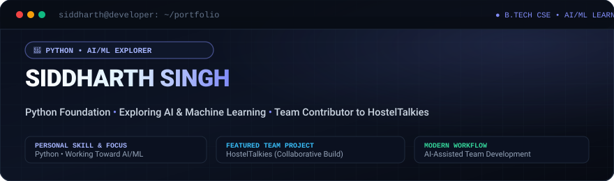
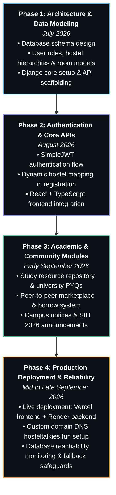

<p align="center">
  
</p>

<h1 align="center">Hi, I'm Siddharth Singh 👋</h1>

<p align="center">
  <a href="https://github.com/siddharth194thakur-gif">
    
  </a>
</p>

<p align="center">
  <a href="https://github.com/siddharth194thakur-gif"></a>
  <a href="mailto:siddharth194.thakur@gmail.com"></a>
  <a href="https://hosteltalkies.fun"></a>
  
</p>

---

### 👨‍💻 About Me

Hi, I'm **Siddharth Singh**, a BTech CSE student focused on building a strong engineering foundation in **Python**, **Backend Architecture**, and **AI / Machine Learning**.

- 🎯 **Core Career Focus**: Dedicated to building my career around **Artificial Intelligence & Machine Learning** — studying foundational mathematics, statistical learning, neural networks, and modern LLM systems.
- ⚙️ **Engineering Foundation**: Grounded in core Computer Science principles — Python, Data Structures & Algorithms (DSA), Relational DBMS (SQL/PostgreSQL), and robust API design.
- 🚀 **Hands-on Builder**: I believe in applying theory to real-world code. Over the past several months, I have been actively developing and maintaining **[HostelTalkies](https://hosteltalkies.fun)**, a full-stack campus and hostel community management platform.

---

### 🤖 AI / ML Focus & Journey

> *My primary technical pursuit is understanding how intelligent systems work from first principles and applying them to solve practical problems.*

```
 🐍 Python
    │
    ▼
 📊 NumPy & Pandas (Data Processing & Matrix Ops)
    │
    ▼
 🧮 Mathematics for ML (Linear Algebra • Calculus • Probability)
    │
    ▼
 🤖 Machine Learning (Supervised & Unsupervised Algorithms)
    │
    ▼
 🧠 Deep Learning (Neural Networks • PyTorch Foundations)
    │
    ▼
 ✨ Generative AI (Transformer Architectures • Embeddings)
    │
    ▼
 🔤 Large Language Models (Prompt Engineering • Structured Output)
    │
    ▼
 🔎 RAG (Retrieval-Augmented Generation • Vector Search)
    │
    ▼
 🤖 Agentic AI (Multi-Step Reasoning • Tool-Augmented Workflows)
```

*Note: I am actively studying and exploring these concepts step-by-step, prioritizing solid mathematical foundations and clean implementation over superficial hype.*

---

### 🧠 Currently Learning

<p align="center">
  
  
  
  
  <br />
  
  
  
  
</p>

- 🐍 **Python & DSA**: Deepening algorithmic thinking, data structures, and optimal time/space complexity.
- 🧮 **Mathematics for ML**: Core linear algebra (eigenvectors, matrix factorizations), multivariate calculus, and probability distributions.
- 📊 **NumPy & Pandas**: Array slicing, vectorized operations, data cleansing, and feature engineering.
- 🤖 **Classical Machine Learning**: Regression, classification, clustering, cross-validation, and performance metrics.
- 🧠 **Deep Learning Foundations**: Understanding forward/backward propagation, activation functions, and building simple PyTorch networks.
- ✨ **Generative AI & LLMs**: Attention mechanisms, tokenizer internals, contextual prompting, and function calling.
- 🔎 **RAG Architectures**: Vector similarity search, embedding pipelines, and external document grounding.
- 🤖 **Agentic AI**: Designing autonomous reasoning agents equipped with multi-step tools.

---

### 🛠️ Tech Stack

*Curated and honest — only technologies I actively write code in and use for projects:*

<div align="center">

| Domain | Technologies |
| :--- | :--- |
| **Primary Core** |    |
| **AI / ML (Exploring & Studying)** |     |
| **Backend (Project Implementation)** |    |
| **Frontend (Supporting UI)** |    |
| **Developer Tools** |    |

</div>

---

### 🚀 Featured Project

<div align="center">
  <h2>🏠 HostelTalkies</h2>
  <p><b>"Your Hostel. Your People. Your Talkies."</b></p>
  <p>
    <a href="https://hosteltalkies.fun"><b>🌐 Live Website: hosteltalkies.fun</b></a> • 
    <a href="https://github.com/siddharth194thakur-gif/Hostel-Talkies-Backend"><b>⚙️ Backend Repository</b></a> • 
    <a href="https://github.com/siddharth194thakur-gif/Hostel-Talkies-Frontend"><b>🎨 Frontend Repository</b></a>
  </p>
</div>

**HostelTalkies** is an authentic full-stack campus and hostel community management platform built to centralize university hostel life — solving fragmented messaging groups, student commerce, academic resource sharing, and official administration announcements.

#### 📌 Real Features:
- 🏛️ **Dynamic Hostel Hierarchy**: Live cascading selection of 16 university hostels, blocks, and room numbers.
- 📦 **P2P Student Marketplace & Borrow Tracker**: Student item listings, campus giveaways, and item borrow/lend tracking.
- 📚 **Academic Study Library**: University lecture notes, branch-wise study resources, and previous year examination question papers (PYQs).
- 📢 **Campus Notices & Circulars**: Official administrative updates, emergency notices, and hackathon announcements (SIH 2026).
- 🛡️ **Defensive Architecture**: Stateless JWT with token refresh cycling, defensive CORS configuration, rate limiting, and automated database reachability safeguards.

```
Backend:   Python 3 • Django 5 • Django REST Framework • SimpleJWT • PostgreSQL
Frontend:  React 19 • TypeScript • Tailwind CSS • Vite • Axios
Hosting:   Render (Backend REST API) • Vercel (Frontend Web App)
```

---

### 📈 HostelTalkies Development Journey

*An authentic timeline backed by ~4 months of continuous Git history and genuine development commits:*



---

### 🎯 My AI/ML Roadmap

*My step-by-step roadmap for progressing from core computer science fundamentals to production-grade AI systems:*


---

### 📊 GitHub Statistics

<div align="center">
  
  &nbsp;
  
  <br /><br />
  
</div>

---

### 🐍 Contribution Activity

<p align="center">
  <picture>
    <source media="(prefers-color-scheme: dark)" srcset="https://raw.githubusercontent.com/siddharth194thakur-gif/siddharth194thakur-gif/output/github-contribution-grid-snake-dark.svg">
    <source media="(prefers-color-scheme: light)" srcset="https://raw.githubusercontent.com/siddharth194thakur-gif/siddharth194thakur-gif/output/github-contribution-grid-snake.svg">
    
  </picture>
</p>

---

### 📫 Connect With Me

<p align="center">
  <a href="mailto:siddharth194.thakur@gmail.com">
    
  </a>
  &nbsp;
  <a href="https://github.com/siddharth194thakur-gif">
    
  </a>
  &nbsp;
  <a href="https://hosteltalkies.fun">
    
  </a>
</p>

---

<div align="center">
  <sub>Built with passion for <b>AI / Machine Learning</b> and dependable software architecture 🚀</sub>
</div>
