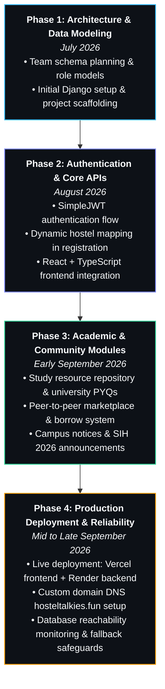

<p align="center">
  
</p>

<h1 align="center">Hi, I'm Siddharth Singh 👋</h1>

<p align="center">
  <a href="https://github.com/siddharth194thakur-gif">
    
  </a>
</p>

<p align="center">
  <a href="https://github.com/siddharth194thakur-gif"></a>
  <a href="mailto:siddharth194.thakur@gmail.com"></a>
  <a href="https://hosteltalkies.fun"></a>
  
</p>

---

### 👨‍💻 About Me

Hi, I'm **Siddharth Singh**, a BTech CSE student.

- 🐍 **Personal Skill**: I have primarily learned **Python** so far and use it as my core programming language.
- 🎯 **Career Direction**: My main future focus is **Artificial Intelligence & Machine Learning**. I am currently learning and exploring AI/ML concepts step by step.
- 👥 **Team Experience**: I contributed as a team member to **[HostelTalkies](https://hosteltalkies.fun)**, a major campus and hostel management web platform built collaboratively with fellow students using modern **AI-assisted development** workflows.

---

### 🤖 Currently Exploring (AI / ML Personal Focus)

*AI/ML is my primary personal learning direction. Rather than claiming mastery, I am actively studying and working toward understanding these areas:*

- 🤖 **Machine Learning**: Foundational concepts, statistical intuition, and standard learning algorithms.
- ✨ **Generative AI**: Principles of tokenization, vector embeddings, and transformer architectures.
- 🔤 **Large Language Models (LLMs)**: Prompt engineering, context augmentation, and structured model interactions.
- 🧩 **Agentic AI**: Multi-step reasoning loops and tool-augmented agent workflows.

---

### 🛠️ Tech Stack & Workflow

*Intentionally small and transparently categorized:*

#### 1. Personal Learning
<p align="left">
  
</p>

#### 2. Project Technologies (HostelTalkies Team Stack)
*Technologies utilized inside the HostelTalkies platform that I worked with as a team member:*

<p align="left">
  
  
  
  
  
  
  
  
</p>

#### 3. Modern Workflow
- ⚡ **AI-Assisted Development**: The team actively integrated AI coding assistants and modern generative tools to accelerate prototyping, code review, schema design, and implementation throughout the project lifecycle.

---

### 🚀 Featured Team Project — HostelTalkies

<div align="center">
  <h2>🏠 HostelTalkies</h2>
  <p><b>"Your Hostel. Your People. Your Talkies."</b></p>
  <p>
    <a href="https://hosteltalkies.fun"><b>🌐 Live Platform: hosteltalkies.fun</b></a> • 
    <a href="https://github.com/siddharth194thakur-gif/Hostel-Talkies-Backend"><b>⚙️ Backend Repository</b></a> • 
    <a href="https://github.com/siddharth194thakur-gif/Hostel-Talkies-Frontend"><b>🎨 Frontend Repository</b></a>
  </p>
</div>

**HostelTalkies** is a full-stack campus and hostel community platform developed collaboratively by a **team**. It was built to solve communication fragmentation, academic sharing hurdles, and student commerce across university dormitories.

#### 📌 Project Highlights & Team Implementation:
- 🤝 **Collaborative Team Build**: Built as a team project where multiple members contributed to frontend, backend, data, and design.
- ⚡ **AI-Assisted Workflow**: The team leveraged modern AI tools throughout the project for scaffolding, debugging, and accelerating feature rollout.
- 🏛️ **Dynamic Hostel Hierarchy**: Live cascading selection of 16 university hostels, blocks, and room numbers.
- 📦 **P2P Marketplace & Borrow Tracker**: Student item listings, campus giveaways, and item borrow/lend tracking workflows.
- 📚 **Study Resources Repository**: Course lecture notes, semester study resources, and university past examination papers (PYQs).
- 📢 **Campus Notices & Announcements**: Administrative circulars, emergency announcements, and hackathon notices (SIH 2026).

```
Project Stack:  Python • Django REST Framework • PostgreSQL • React • TypeScript • Tailwind CSS
Deployment:     Render (Backend API) • Vercel (Frontend Web App)
```

---

### 📈 HostelTalkies Development Journey

*An authentic timeline of the team's ~4 months of continuous development and genuine Git commits:*



---

### 📊 GitHub Statistics

<div align="center">
  
  &nbsp;
  
  <br /><br />
  
</div>

---

### 🐍 Contribution Activity

<p align="center">
  <picture>
    <source media="(prefers-color-scheme: dark)" srcset="https://raw.githubusercontent.com/siddharth194thakur-gif/siddharth194thakur-gif/output/github-contribution-grid-snake-dark.svg">
    <source media="(prefers-color-scheme: light)" srcset="https://raw.githubusercontent.com/siddharth194thakur-gif/siddharth194thakur-gif/output/github-contribution-grid-snake.svg">
    
  </picture>
</p>

---

### 📫 Connect With Me

<p align="center">
  <a href="mailto:siddharth194.thakur@gmail.com">
    
  </a>
  &nbsp;
  <a href="https://github.com/siddharth194thakur-gif">
    
  </a>
  &nbsp;
  <a href="https://hosteltalkies.fun">
    
  </a>
</p>

---

<div align="center">
  <sub>Siddharth Singh • BTech CSE Student • Exploring <b>AI / Machine Learning</b> 🚀</sub>
</div>
